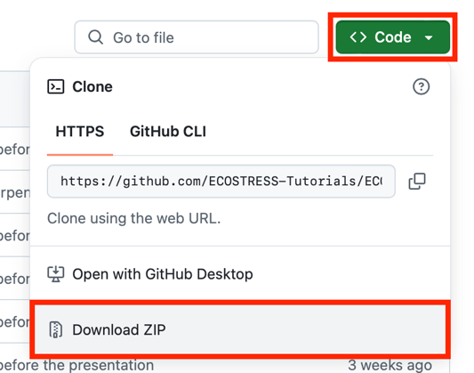
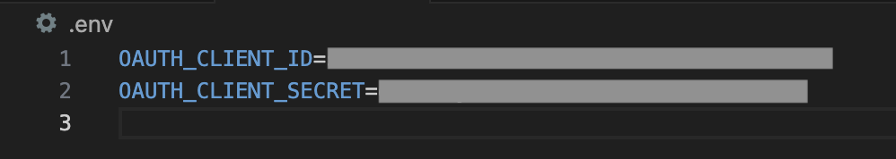

> *This tutorial will show you how to use the ECOSTRESS Sharpening API
> code on MacOS.*

# Table of Contents

[Prerequisites](#prerequisites)

[What is Sharpening and what is an API?](#what-is-sharpening-and-what-is-an-api)

[What is Copernicus Data Space?](#what-is-copernicus-data-space)

[Creating a Copernicus Login](#creating-a-copernicus-login)

[What is pyDMS?](#what-is-pydms)

[Downloading Code and pyDMS from GitHub](#downloading-code-and-pydms-from-github)

[What is an OAuth client?](#what-is-an-oauth-client)

[Creating a New OAuth Client](#creating-a-new-oauth-client)

[How to Install the Required Packages for your Environment](#how-to-install-the-required-packages-for-your-environment)

[How to Install pyDMS](#how-to-install-pydms)

[Setting up and Running the Code](#_Toc182902956)

# Prerequisites

Before you start this tutorial, make sure you have an Earthdata Login,
Visual Studio Code downloaded and set up, and a Python Environment to
work with. If you need help setting any of these up, please visit
<https://ecostress.jpl.nasa.gov/tutorials> where you can follow along
with the provided tutorials before proceeding with this one. This
tutorial will walk you through an example of sharpening images of Dodger
Stadium in summer of 2024, but you can follow along with whatever area
and time of interest you want.

# What is Sharpening and what is an API?

In remote sensing, image sharpening refers to enhancing the spatial
resolution of satellite images in order to make them look more detailed.
We use high resolution images to train a machine-learning model which is
then used to sharpen low resolution images. In this code, 70-meter
resolution ECOSTRESS data will be sharpened with 20-meter Sentinel-2
data. This tool also uses APIs (Application Programming Interfaces) to
download both ECOSTRESS and Sentinel-2 data in your region and time of
interest. If you have already downloaded ECOSTRESS data that you would
like to sharpen, you can follow the Sharpening Code tutorial that only
uses and API to download Sentinel-2 data.

# What is Copernicus Data Space?

Copernicus Data Space is a European Space Agency platform that provides
open data from the Copernicus Earth observation satellites, including
Sentinel-2 data. We need a Copernicus Data Space login in order to
create and use the Sentinel Hub API. An API, or Application Programming
Interface, is a tool that allows your code to request and retrieve data
from a server or database automatically.

## Creating a Copernicus Login

1.  Start by going to <https://dataspace.copernicus.eu/> or by searching
    the web for **Copernicus Data Space** and clicking on the first
    link. On the website, click the **green profile icon**.

2.  This will take you to the login page. If you already have an
    account, you can log in and move on to the next section of the
    tutorial. If you do not have an account, click the green register
    button.

3.  Fill out all of the required fields with your personal information,
    including marking off the check boxes at the bottom of the screen.
    When you are done, click the green register button.

4.  The window will now display **Thank you for signing up** and prompt
    you to verify your email. Open your email and look for the
    verification email.

5.  Click the blue **Verify email address** button which will direct you
    back to the Copernicus Data Space website.

6.  In the new window, click where it says **Click here to proceed**. It
    will then let you know that your email address has been verified.

>  style="width:3.5758in;height:1.36111in"
> alt="Graphical user interface, application, Word Description automatically generated" /> style="width:3.5724in;height:1.06944in"
> alt="Graphical user interface Description automatically generated" />

# What is pyDMS?

pyDMS is a Python library that implements the Data Mining Sharpened
(DMS) algorithm, that is used to sharpen low resolution satellite
imagery using high resolution data. We want to use this in our code, so
we need to download and install it. We can download it from GitHub,
which is an online platform used to store and share code.

## Downloading Code and pyDMS from GitHub

1.  To access the pyDMS package and the code used in this tutorial, go
    to
    <https://github.com/ECOSTRESS-Tutorials/ECOSTRESS-Sharpening-Tutorial>.

2.  At the top right, click the green button that says **\<\> Code**. In
    the dropdown select **Download ZIP**. A zip file containing
    everything in the GitHub repository will begin downloading.

3.  Once the zip file has been downloaded, **double click** on it to
    un-zip it. This new folder will now function as your **project
    folder**. You can move it wherever you would like, but I am going to
    move mine to my documents.

# What is an OAuth client?

An OAuth client requests access to data on behalf of the user without
needing their password. Instead, OAuth creates a secure token, or
temporary key, that can be used to access the data for as long as you
allow it. This ensures that your account details stay safe when
downloading data.

## Creating a New OAuth Client

1.  Open Visual Studio Code and get connected to your project folder by
    selecting **File \> Open Folder.** In the pop-up finder window,
    select your project folder and click **Open**.

2.  In the **EXPLORER** tab on the left, hover over the project folder
    and click the **new file icon**.

3.  Name this new file **.env** and press enter.

4.  Next, in a browser window, go to <https://dataspace.copernicus.eu/>
    or by search for **Copernicus Data Space** and log in. Then, click
    the **green profile icon**.

5.  In the new window, find the box that says **Dashboards** and click
    the link that says **Sentinel Hub**.

6.  In the Dashboard window, click **User Settings** in the bottom
    right.

7.  Look for the box titled **OAuth clients** and click the green
    **+Create** button.

8.  In the pop-up, type in a **Client name**. This name is just a way to
    identify the client for your organization and clarity. For example,
    I am going to name mine **ECOSTRESS_Sharpening**. Once you have
    entered a name, press the green **+Create** button.

9.  A pop-up will appear with your Client ID and Secret. <u>Do not close
    this window because you will not be able to view it again once it is
    gone!</u> Navigate back to Visual Studio Code and open the **.env**
    file that you created. In the **.env** file, type:

    1.  OAUTH_CLIENT_ID=your-client-id

    2.  OAUTH_CLIENT_SECRET=your-client-secret

10. Replace **your-client-id** with the Client ID that was given in the
    Copernicus Data Space OAuth creation by copying and pasting. Do the
    same with **your-client-secret**. Save your .env file. You can now
    close the OAuth pop-up window.

## How to Install the Required Packages for your Environment

1.  If you followed the creating an environment tutorial, you will need
    to install a few more packages to the ECOSTRESS environment you
    created. If you are working with a different environment, or using
    the ECOSTRESS environment from a previous tutorial, you can look at
    the different packages installed within your environment to see what
    you have and what you need.

    1.  To do this, open the **terminal** and type **mamba activate**
        followed by the name of your environment. Press enter to run.
        You will know your environment has been activated when its name
        shows up in parentheses.

2.  Then type **conda list** and press **enter** to run. This will list
    all the packages in your environment.

3.  Compare this to the list of packages on the **requirements.txt**
    document that you downloaded from the GitHub as part of the main
    project folder. Take note of which ones you still need to install.

2.  To install the remaining packages, first make sure that your
    environment is activated (its name should be listed at the start of
    the terminal command line in parentheses). If it is not activated,
    type **mamba activate** followed by the name of your environment and
    run it.

3.  Then, type **mamba install -c conda-forge** followed by the name of
    all the packages you need to install. If you used the Creating an
    Environment ECOSTRESS tutorial, you can copy and paste this into the
    terminal and run it to get all the remaining packages installed:

**mamba install -c conda-forge gdal libgdal shapely geopandas
sentinelhub numba python-dotenv**

1.  However, it is best to list the packages in your own environment and
    make sure you are missing the same ones as me. If you are missing
    different ones, you can modify the command accordingly.

<!-- -->

4.  It may ask you to **Confirm changes y/n** for which you can type
    **y** and press enter.

5.  It should look something like this when it is done:

## How to Install pyDMS

1.  Open the terminal and activate your environment by typing **mamba
    activate** followed by the name of your environment.

2.  Then, change the directory to the pyDMS_main folder by typing the
    command **cd** followed by a space and the path to the folder.

1.  To copy the path to the folder, go to **View \> Show Path Bar**.
    Then in your finder, navigate to the folder. Find where the folder
    is listed in the path bar on the bottom of the window. Right click
    it and select **Copy “pyDMS_main” as Pathname**.

3.  Then, in the terminal type **python setup.py install** and run it.
    Now you have an environment set up to run the downscaling code with.

## Setting up and Running the Code

1.  In **Visual Studio Code**, open the
    **Sharpening_ECOSTRESS_S2_API.ipynb** Jupyter Notebook. At the top
    of the file there is a lot of information about how the code works
    that you can read if you are interested. Scroll down to the block of
    code that is used to **import libraries**. Click into the code and
    press **Shift + Enter** to run it.

    1.  At the top of the window, a pop up will appear prompting you to
        **select a kernel** to run your code with. Click on **Python
        Environments …**

2.  Select the **ECOSTRESS** environment that you created, or another
    one if you have a different one you want to use.

3.  You will know it is done running when a green check mark appears on
    the bottom left of the cell.

2.  Next, scroll down to the section of the code under **OAuth
    Copernicus Data Space.** If you followed this tutorial and set up
    your OAuth in a **.env** file, you should be able to press **Shift +
    Enter** to run this block of code. If you set up your OAuth in
    another way, you may need to adjust the code accordingly.

3.  Next, find the block of code under **Type your NASA Earthdata login
    and password** and press **Shift + Enter** to run it.

1.  At the top of the Visual Studio Code window, an input box will
    appear prompting you to **Enter NASA Earthdata Login Username:**.
    Type in your username and press enter.

2.  Then, it will prompt you to **Enter NASA Earthdata Login
    Password:**. Type this in and press enter.

4.  In the next block of code, find the variable called
    **s2_output_folder**. Set this variable to the path of an output
    folder for the Sentinel 2 imagery. I am going to do this by creating
    a **new folder** in my **project folder** and copying its path into
    the code. Make sure the path still has **r** in front and is wrapped
    in quotes.

  
Example:

5.  Then find the variable titled **eco_output_folder** and set it to
    the path of an output folder for the ECOSTRESS imagery. Again, I am
    going to create a **new folder** for this in the main **project
    folder** and copy its path into the code. Make sure the path still
    has **r** in front and is wrapped in quotes.

Example:

6.  Finally, find the variable titled **dst_dir**. Set it to a path of a
    folder to store the final sharpened images. Once again, I am going
    to create a **new folder** for this in the main **project folder**
    and copy its path into the code. Make sure the path still has **r**
    in front and is wrapped in quotes.

Example:

7.  Once all your variables are set, press **Shift + Enter** to run the
    code. At the top of the window, another input box will appear asking
    you to enter a **task name**. This is just the name of the request
    that will be named in AppEEARS. Enter a name and then press enter.

Example:

8.  Scroll down to the next block of code under **Set the parameters for
    the products to be downloaded** and find the variable titled
    **aoi_coords_wgs_84**. We need to set this variable equal to the
    coordinates of a bounding box for our study area. To get these
    coordinates, click on the link in the code or search the web for
    **bboxfinder.com**.

9.  On the website, **zoom into** your area of interest on the map. Then
    click the **draw a shape icon**. Click on the map to create a box
    around your area of interest and click on the first point you made
    to close the box.

10. Then, at the bottom of the screen, **copy** the coordinates listed
    after **Box**. Go back to Visual Studio Code and **Paste** these
    coordinates into the variable.

Example:

11. Next, you can set the resolution of the Sentinel 2 data by adjusting
    the variable called **s2_res**. For now, I will leave it at 20.

12. You can also specify the **collection** of ECOSTRESS images that you
    want to use. At the time of this tutorial’s creation, collection 2
    is still being processed, so I am going to set this to **1**. Please
    refer to <https://ecostress.jpl.nasa.gov/data> for information about
    collection processing.

13. Finally, we need to change the **interval** variable to represent
    the start and end date for which we are interested in getting data.
    Make sure to enter these dates in the **“YYYY-MM-DD”** format.

Example:

14. Once all of the variables are set, run this block of code by
    pressing **Shift + Enter.**

15. Continue to the next block of code and press **Shift + Enter** to
    run it. The bounding box is limited to **2500 pixels**, so if you
    get an error about this you will need to **reduce** the size of your
    bounding box and re-run that block of code.

16. Run the next **four** blocks of code including:

    1.  **Download the S2 image with the previously defined
        parameters.**

2.  **Authentication and Token Retrieval for NASA AppEEARS API**

3.  **Locate ECOSTRESS products and search for the layers of interest in
    our case: LST and QC**

4.  **Formulate the AppEEARs request**

17. Then find the next block of code under **Ping the API** and press
    **Shift + Enter** to run it. This code will check in with the
    AppEEARS request every 30 seconds and give you a report such as
    **queued** or **processing**. This code may take a while to run
    since it takes time for the requests to be fulfilled. You can leave
    this part of the code to run and come back later.

1.  You will know you are ready to proceed when the code output says
    **done**.

18. Run the block of code under **Download the ordered files** to
    download the ECOTRESS files to your computer.

19. From here, your code should be ready to run the next **four**
    modules including:

    1.  **Sort the downloaded files in appropriate sub-directories**

2.  **Preprocessing the QC files**

**Tip**: If you get a Rasterio error similar to this, your files may
have been corrupted. In order to fix this, go to your ECO_Outputs folder
and delete everything. Then go back and run the **Download the ordered
files**, **Sort the downloaded files in appropriate subdirectories,**
and **Preprocessing the QC files** cells. The error should be resolved.

**  
**

3.  **Scaling the ECOSTRESS LST to normal Kelvin Scale**

4.  **Unsampling using pyDMS**

    1.  Use the first block of code under this header if you want to
        process the entire extent of the image.

2.  Use the second block of code under this header if you only want to
    sample part of the image.

20. Once you have run these modules, you now have sharpened ECOSTRESS
    imagery! In order to see an **image plotted** of the sharpened
    scenes, you can run the block of code under the **Display** section.

1.  Example of **Plot one random sharpened image:**

