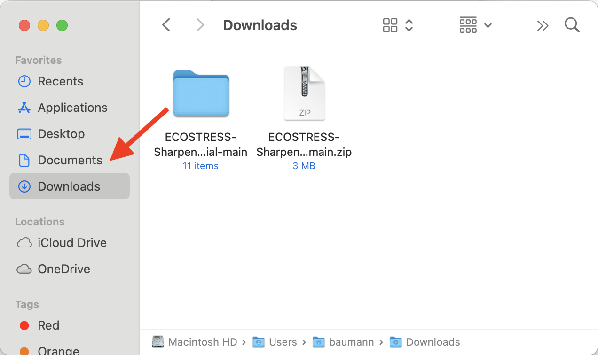
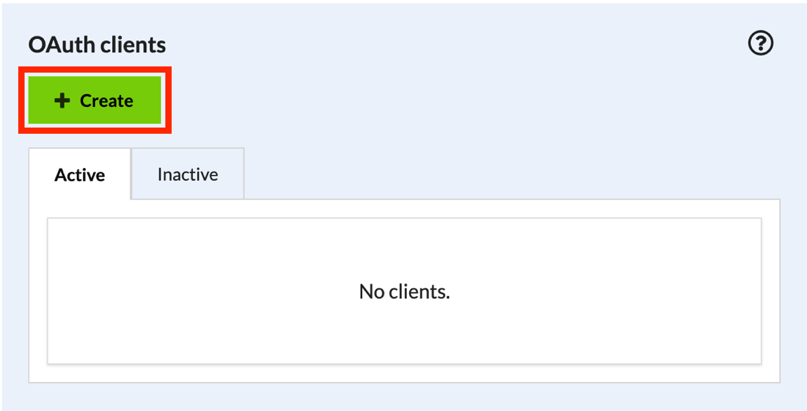
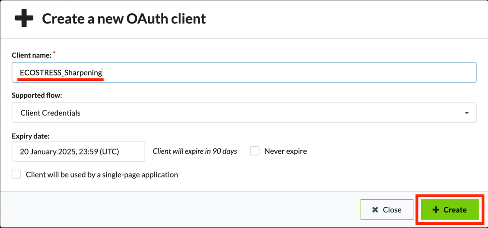
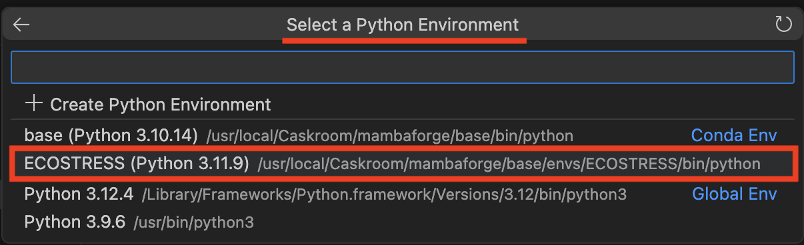

> *This tutorial will show you how to use the ECOSTRESS Sharpening code
> on MacOS.*

# Table of Contents

[Prerequisites](#prerequisites)

[What is Sharpening and what is an API?](#_Toc181004730)

[What is Copernicus Data Space?](#what-is-copernicus-data-space)

[Creating a Copernicus Login](#_Toc181004732)

[What is pyDMS?](#what-is-pydms)

[Downloading Code and pyDMS from GitHub](#_Toc181004734)

[What is an OAuth client?](#what-is-an-oauth-client)

[Creating a New OAuth Client](#_Toc181004736)

[How to Install the Required Packages for your Environment](#how-to-install-the-required-packages-for-your-environment)

[How to Install pyDMS](#how-to-install-pydms)

[Setting up and Running the Code](#_Toc181004739)

# Prerequisites

Before you start this tutorial, make sure you have an Earthdata Login,
Visual Studio Code downloaded and set up, and a Python Environment to
work with. You also need ECOSTRESS LST data downloaded on your computer
for this tutorial. If you do not have ECOSTRESS data downloaded, you can
either download it before starting this tutorial or you can follow the
Sharpening API Code tutorial that uses and API to download both
ECOSTRESS and Sentinel-2 data. If you need help setting any of these up
or downloading ECOSTRESS data, please visit
<https://ecostress.jpl.nasa.gov/tutorials> where you can follow along
with the provided tutorials before proceeding with this one. This
tutorial will walk you through an example of sharpening images of Dodger
Stadium in summer of 2024, but you can follow along with whatever area
and time of interest you want.

# What is Sharpening and what is an API?

In remote sensing, image sharpening refers to enhancing the spatial
resolution of satellite images in order to make them look more detailed.
We use high resolution images to train a machine-learning model which is
then used to sharpen low resolution images. In this code, 70-meter
resolution ECOSTRESS data will be sharpened with 20-meter Sentinel-2
data. This tool uses an API (Application Programming Interface) to
download Sentinel-2 data that will be used to sharpen ECOSTRESS LST
images that you already have downloaded on your computer.

# What is Copernicus Data Space?

Copernicus Data Space is
a European Space Agency platform that provides open data from the
Copernicus Earth observation satellites, including Sentinel-2 data. We
need a Copernicus Data Space login in order to create and use the
Sentinel Hub API. An API, or Application Programming Interface, is a
tool that allows your code to request and retrieve data from a server or
database automatically.

## Creating a Copernicus Login

1.  Start by going to <https://dataspace.copernicus.eu/> or by searching
    the web for **Copernicus Data Space** and clicking on the first
    link. On the website, click the **green profile icon**.

2.  This will take you to the login page. If you already have an
    account, you can log in and move on to the next section of the
    tutorial. If you do not have an account, click the green register
    button.

3.  Fill out all of the required fields with your personal information,
    including marking off the check boxes at the bottom of the screen.
    When you are done, click the green register button.

4.  The window will now display **Thank you for signing up** and prompt
    you to verify your email. Open your email and look for the
    verification email.

5.  Click the blue **Verify email address** button which will direct you
    back to the Copernicus Data Space website.

6.  In the new window, click where it says **Click here to proceed**. It
    will then let you know that your email address has been verified.

>  style="width:3.86771in;height:1.47222in"
> alt="Graphical user interface, application, Word Description automatically generated" /> style="width:3.94356in;height:1.18056in"
> alt="Graphical user interface Description automatically generated" />

# What is pyDMS?

pyDMS is a Python library
that implements the Data Mining Sharpened (DMS) algorithm, that is used
to sharpen low resolution satellite imagery using high resolution data.
We want to use this in our code, so we need to download and install it.
We can download it from GitHub, which is an online platform used to
store and share code.

## Downloading Code and pyDMS from GitHub

1.  To access the pyDMS package and the code used in this tutorial, go
    to
    <https://github.com/ECOSTRESS-Tutorials/ECOSTRESS-Sharpening-Tutorial>.

2.  At the top right, click the green button that says **\<\> Code**. In
    the dropdown select **Download ZIP**. A zip file containing
    everything in the GitHub repository will begin downloading.

3.  Once the zip file has been downloaded, **double click** on it to
    un-zip it. This new folder will now function as your **project
    folder**. You can move it wherever you would like, but I am going to
    move mine to my documents.

# What is an OAuth client?

An OAuth client requests
access to data on behalf of the user without needing their password.
Instead, OAuth creates a secure token, or temporary key, that can be
used to access the data for as long as you allow it. This ensures that
your account details stay safe when downloading data.

## Creating a New OAuth Client

1.  Open Visual Studio Code and get connected to your project folder by
    selecting **File \> Open Folder.** In the pop-up finder window,
    select your project folder and click **Open**.

2.  In the **EXPLORER** tab on the left, hover over the project folder
    and click the **new file icon**.

3.  Name this new file **.env** and press enter.

4.  Next, in a browser window, go to <https://dataspace.copernicus.eu/>
    or by search for **Copernicus Data Space** and log in. Then, click
    the **green profile icon**.

5.  In the new window, find the box that says **Dashboards** and click
    the link that says **Sentinel Hub**.

6.  In the Dashboard window, click **User Settings** in the bottom
    right.

7.  Look for the box titled **OAuth clients** and click the green
    **+Create** button.

8.  In the pop-up, type in a **Client name**. This name is just a way to
    identify the client for your organization and clarity. For example,
    I am going to name mine **ECOSTRESS_Sharpening**. Once you have
    entered a name, press the green **+Create** button.

9.  A pop-up will appear with your Client ID and Secret. <u>Do not close
    this window because you will not be able to view it again once it is
    gone!</u> Navigate back to Visual Studio Code and open the **.env**
    file that you created. In the **.env** file, type:

    1.  OAUTH_CLIENT_ID=your-client-id

    2.  OAUTH_CLIENT_SECRET=your-client-secret

10. Replace **your-client-id** with the Client ID that was given in the
    Copernicus Data Space OAuth creation by copying and pasting. Do the
    same with **your-client-secret**. Save your .env file. You can now
    close the OAuth pop-up window.

## How to Install the Required Packages for your Environment

1.  If you followed the creating an environment tutorial, you will need
    to install a few more packages to the ECOSTRESS environment you
    created. If you are working with a different environment, or using
    the ECOSTRESS environment from a previous tutorial, you can look at
    the different packages installed within your environment to see what
    you have and what you need.

    1.  To do this, open the **terminal** and type **mamba activate**
        followed by the name of your environment. Press enter to run.
        You will know your environment has been activated when its name
        shows up in parentheses.

2.  Then type **conda list** and press **enter** to run. This will list
    all the packages in your environment.

3.  Compare this to the list of packages on the **requirements.txt**
    document that you downloaded from the GitHub as part of the main
    project folder. Take note of which ones you still need to install.

2.  To install the remaining packages, first make sure that your
    environment is activated (its name should be listed at the start of
    the terminal command line in parentheses). If it is not activated,
    type **mamba activate** followed by the name of your environment and
    run it.

3.  Then, type **mamba install -c conda-forge** followed by the name of
    all the packages you need to install. If you used the Creating an
    Environment ECOSTRESS tutorial, you can copy and paste this into the
    terminal and run it to get all the remaining packages installed:

**mamba install -c conda-forge gdal libgdal shapely geopandas
sentinelhub numba python-dotenv**

1.  However, it is best to list the packages in your own environment and
    make sure you are missing the same ones as me. If you are missing
    different ones, you can modify the command accordingly.

<!-- -->

4.  It may ask you to **Confirm changes y/n** for which you can type
    **y** and press enter.

5.  It should look something like this when it is done:

## How to Install pyDMS

1.  Open the terminal and activate your environment by typing **mamba
    activate** followed by the name of your environment.

2.  Then, change the directory to the pyDMS_main folder by typing the
    command **cd** followed by a space and the path to the folder.

1.  To copy the path to the folder, go to **View \> Show Path Bar**.
    Then in your finder, navigate to the folder. Find where the folder
    is listed in the path bar on the bottom of the window. Right click
    it and select **Copy “pyDMS_main” as Pathname**.

3.  Then, in the terminal type **python setup.py install** and run it.
    Now you have an environment set up to run the downscaling code with.

## Setting up and Running the Code

1.  In **Visual Studio Code**, open the
    **Sharpening_ECOSTRESS_S2.ipynb** Jupyter Notebook. At the top of
    the file there is a lot of information about how the code works that
    you can read if you are interested. Scroll down to the block of code
    that is used to **import libraries**. Click into the code and press
    **Shift + Enter** to run it.

    1.  At the top of the window, a pop up will appear prompting you to
        **select a kernel** to run your code with. Click on **Python
        Environments …**

2.  Select the **ECOSTRESS** environment that you created, or another
    one if you have a different one you want to use.

3.  You will know it is done running when a green check mark appears on
    the bottom left of the cell.

2.  The next section of code sets up all the **directories** (dir) to
    input and output locations. In the
    **ECOSTRESS-Sharpening-Tutorial-main** folder, I suggest making
    separate folders for each of the required directories. You can do
    this by **right clicking** in the **Finder** window, selecting **New
    Folder**, and naming the folder.

3.  The folders that you need include:

1.  **S2_output_folder** – a folder to store the Sentinel-2 images that
    the API will download. Leave this empty for now.

2.  **QC_dir** – a folder with all of the QC files that you downloaded.
    If you do not have QC files, you do not need this folder.

3.  **cloud_dir** – a folder with all of the cloud mask files that you
    downloaded.

4.  **lst_dir** – a folder with all of the raw LST files that you
    downloaded

    1.  Alternatively, if you already scaled your LST files, you can put
        them in a folder called **lst_dir_sc**

5.  **dst_dir** – a destination folder where your sharpened images will
    be saved.

<!-- -->

4.  Next, **copy** the **path** to these folders and **paste** them into
    the code next to their associated variable.

> **Example:**
>
>  style="width:6.28747in;height:1.64352in"
> alt="Text, chat or text message Description automatically generated" />

5.  Next, scroll down to the section of the code under **OAuth
    Copernicus Data Space.** If you followed this tutorial and set up
    your OAuth in a **.env** file, you should be able to press **Shift +
    Enter** to run this block of code. If you set up your OAuth in
    another way, you may need to adjust the code accordingly.

>  style="width:4.91204in;height:0.77879in"
> alt="Text Description automatically generated" />

6.  Scroll down to the next block of code under **Set the parameters for
    Sentinel-2 data to be downloaded** and find the variable titled
    **aoi_coords_wgs_84**. We need to set this variable equal to the
    coordinates of a bounding box for our study area. To get these
    coordinates, click on the link in the code or search the web for
    **bboxfinder.com**.

7.  On the website, **zoom into** your area of interest on the map. Then
    click the **draw a shape icon**. Click on the map to create a box
    around your area of interest and click on the first point you made
    to close the box.

8.  Then, at the bottom of the screen, **copy** the coordinates listed
    after **Box**. Go back to Visual Studio Code and **Paste** these
    coordinates into the variable.

Example:

9.  Next, you can set the resolution of the Sentinel 2 data by adjusting
    the variable called **s2_res**. For now, I will leave it at 20.

10. Finally, we need to change the **interval** variable to represent
    the start and end date for which we are interested in getting data.
    Make sure to enter these dates in the **“YYYY-MM-DD”** format.

Example:

11. Once all of the variables are set, run this block of code by
    pressing **Shift + Enter.**

12. Run the next **three** blocks of code including:

    1.  **Download the S2 image with the previously defined
        parameters.**

2.  **Preprocessing the QC files**

3.  **Scaling the ECOSTRESS LST to normal Kelvin scale.** However, if
    you used pre-scaled images, you can skip running this block of code.

13. You are now ready to sharpen your images! There are **four different
    options** of code blocks that you can run depending on your desired
    **extent** and if you have **QC files** or not. Read this section of
    the code and **decide which option is best** for your data:

14. Once you have decided which block of code is best for your data,
    scroll down to that section, **click** into the code block, and
    press **Shift+Enter** to run it. You should get a list of outputs
    that looks something like this:

15. You now have sharpened ECOSTRESS imagery! In order to see an **image
    plotted** of the sharpened scenes, you can run the block of code
    under the **Display** section.

1.  Example of **Plot one random sharpened image:**

